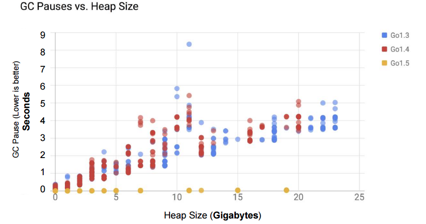
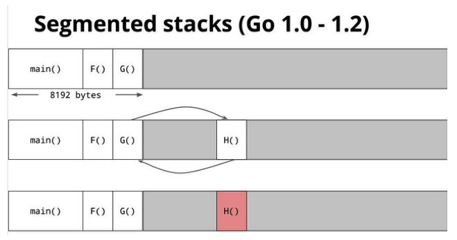
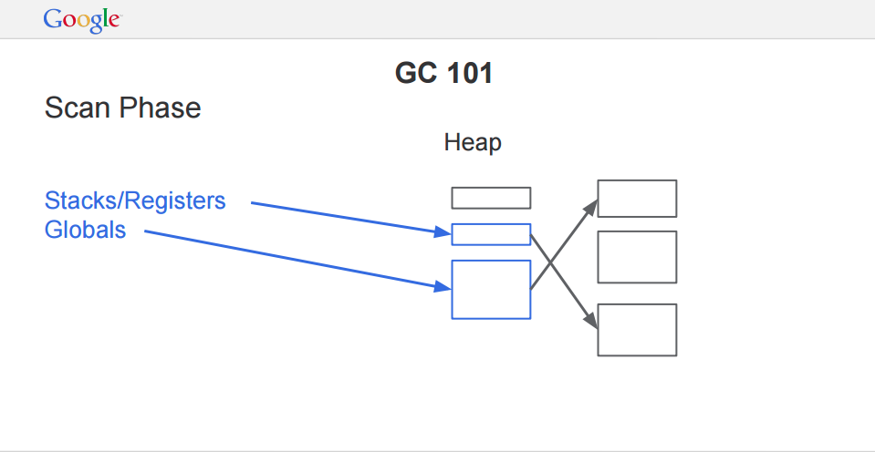
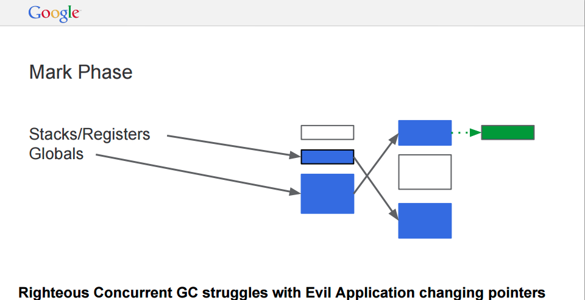
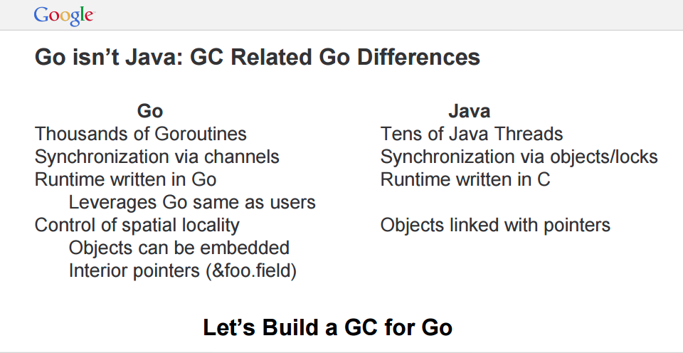
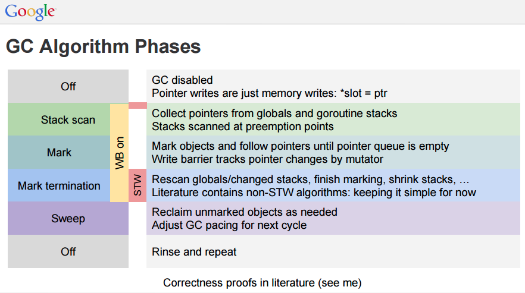
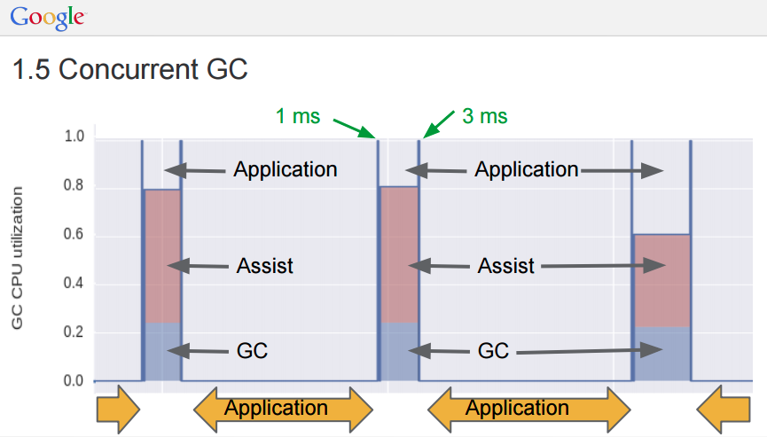

name: inverse
layout: true
class: center, middle, inverse
---

# Сборка мусора в Go

Адрес презентации - http://m0sth8.github.io/gc-1/

.footnote.to-bottom[Вячеслав Бахмутов http://twitter.com/m0sth8]

---
name: go-gc-pdf
layout: true
class: center, middle

{{content}}

.footnote.to-right[Слайд из презентации [Go GC: Latency Problem Solved](https://talks.golang.org/2015/go-gc.pdf)]
---

???

Не смотря на то, что каждая версия Go улучшала производительность сборщика мусора, но именно с выходом версии 1.5 произошли качественные изменения. На конференции Gophercon 2015 в своём докладе Go GC: Solving the Latency Problem ([видео](https://www.youtube.com/watch?v=aiv1JOfMjm0), [слайды](https://talks.golang.org/2015/go-gc.pdf)), Рик Хадсон (главный ответственный за сборщик мусора в Go, которого год назад гугл переманил из интела) рассказал об основных изменениях. Большую часть информации мы разберём дальше, но сейчас обратите внимание на вот этот слайд.

Видно, что версия 1.5 существенно уменьшила размер пауз при сборке мусора. В этом докладе мы попробуем разобраться как этого удалось добиться.
---
layout: false

# Содержание

### 1. О работе с памятью
### 2. Сборка мусора
### 3. Эволюция сборщика в Go 
### 4. Конкурентный сборщик в Go 1.5

---
name: sub-article
layout: true
class: center, middle, sub-article
---

# О работе с памятью. 
## Выделение памяти.

???
Есть три типа выделения памяти.

---
layout: false

# Статическая аллокация

.resize-y[]

???
1. Статическая аллокация. Это самый первый способ, в котором память можно было выделять только на этапе компиляции. Все размеры данных известны заранее, не нужно ничего запрашивать и очищать. Всё работает очень быстро и с прямым доступом к памяти. С другой стороны нельзя вызвать одну и ту же функцию второй раз. Так что рекурсия отпадает. Использовалась в ранних версиях фортрана.

---
layout: true

# Выделение памяти на стеке

---

.resize-y[]

???
2. Выделение памяти на стеке. Каждому треду выделяется память под растущий стек(LIFO). При вызове функции, на стеке размещаются адрес возврата, аргументы функции, возвращаемые данные и локальные переменные. Таким образом при рекурсивном вызове, все данные будут разделены. Работа со стеком очень быстрая, легко выделять и отдавать память. Но нельзя обращаться к одним и тем же данным из разных функций, приходится копировать их при каждом вызове. Так же нужно следить за тем, чтобы не выйти за размеры стека (если только  в языке нет поддержки split стеков или альтернатив). Пример стека https://developer.apple.com/library/mac/documentation/DeveloperTools/Conceptual/LowLevelABI/100-32-bit_PowerPC_Function_Calling_Conventions/32bitPowerPC.html

---

---

.resize[]

---

layout: false

# Выделение памяти в куче

.resize[]

???
3. Выделение памяти в куче - в определенном месте памяти, ваш код может получить место для хранения данных. В дальнейшем ссылку на эту память можно передавать между функциями и даже работать с этой памятью одновременно в разных потоках программы. Практически все современные языки поддерживают хранение в куче. Но доступ к такой памяти значительно медленнее чем к стеку. Где-то нужно хранить информацию о занятой и доступной памяти, при выделении нужно искать подходящий по размерам кусок итд.

---

layout: false

# Выделение памяти

## Статическая аллокация
## Выделение памяти на стеке
## Выделение памяти в куче

---
layout: false
template: sub-article

# О работе с памятью. 
## Управление памятью

???
Есть разные способы управлять памятью

---

# Ручное управление памятью

## - malloc, free в C
## - new, delete в C++

???
Управлять памятью можно несколькими способами, например вручную, как сделано во многих низкоуровневых языках, вроде C, C\++. Вы сами выделяете(аллоцируете) нужную память и потом сами же очищаете её. Не смотря на то, что это достаточно быстро, а паузы при выделении памяти почти предсказуемы, существует ряд проблем. Например разработчик может забыть очистить память, или наоборот, очистить слишком рано. Так же есть возможность случайно или специально перезаписать неправильный кусок памяти. И чем больше людей участвуют в разработке - тем выше вероятность утечек и ошибок. 

[подробнее](http://www.bogotobogo.com/cplusplus/memoryallocation.php)

---

# Подсчёт ссылок

.resize[]

???
Поэтому появились техники, которые снимают с разработчика ответственность за управление памятью.
Одна из таких техник, это подсчет ссылок(reference counting). Применяется в Objective-C с ARC. Python, шаред поинтеры в C\++. Смысл в том, что с каждым объектом связан счетчик, который показывает, сколько других объектов ссылается на него. В тот момент, когда счетчик обнуляется, этот объект можно освободить. С одной стороны можно с некоторой уверенностью предсказывать паузы при выделении памяти, и получается небольшой по памяти, как при работе со сборщиком мусора.
Не смотря на то, он имеет множество плюсов, но у него так же есть и недостатки. ::(Добавить плюсы и недостатки)
- дополнительная память для счетчиков
- проблемы с циклическими ссылками (решаются слабыми ссылками или работающим рядом сборщиком)
- проблема работы со счетчиками из разных потоков (нарушение локальности и требование атомарности)
- общий константный оверхед по производительности обычно больше чем при работе сборщиков мусора (cpu vs memory)
- проблемы при удалении объектов, когда может начаться шквал удалений других объектов (может решаться через отложенное освобождение ресурсов)

---
template: sub-article
# Сборка мусора

???
Другая техника, это использование сборщика мусора. Популярные представители это Джава, дотнет, го, итд. Смысл в том, что рядом с программой есть рантайм, который переодически сканирует все обьекты в памяти, находит те, что больше не используются и освобождает их.

---

# Сканирование корневых объектов

.resize[]

---

# Проход по ссылкам и маркировка

.resize[]

---

# Очистка неиспользуемой памяти

.resize[]

---

# Типы сборщиков

.resize[]

???
Компактизация плюсы:
* Быстрые аллокации
* Уменьшение фрагментации

Добавление поколений

---

# Типы сборщиков по конкуретности

.resize[]

---
layout: true

# Отличия языка Go

---

.resize[]

.footnote.to-right[Слайд из презентации [Go GC: Latency Problem Solved](https://talks.golang.org/2015/go-gc.pdf)]

---

- Старается много не аллоцировать 
  - хитрые аллокаторы (три вида для разных размеров, локальный кеш на P)
  - оптимизации компилятора (строки и массивы байт)
  - эскейп анализ и инлайнинг
- Вложенные структуры лежат рядом и есть ссылки внутрь объектов
- Соблюдение локальности кеша для горутин
- Рантайм Go написан на Go и работает вместе с вашим кодом

???

Количество аллокаций очень важно, в Java и C# всё сделано изначально неверно, все объекты содержат ссылки на другие объекты. В отличии от них, в Go вложенные структуры лежат в одном месте и язык позволяет иметь ссылку внутрь обекта. Это усложняет сборщик мусора, но сильно улучшает работу сборщика. Вместо того, чтобы на каждое поле аллоцировать новую память, а потом перебирать её при сборке, у нас есть ссылки на разные поля одного объекта и сборщик обрабатывает только его. 

Примерно такая же оптимизация происходит при работе со слайсами и словарями. В случае если ключи и значения не содержат в себе поинтеры, сборщик не проверяет каждый объект, а рассматривает набор как одно целое. Что сильно уменьшает его работу.

Работа со стеком, почти всё что не уходит наружу, то кладётся в стек. Инлайнинг(который работает и со стандартной библиотекой, учитывающей это) и эскейп анализ способствует этому. Это помогает делать срыкто то, что есть в расте под названием ownership или uniq pointer в C\++.

---
layout: false
template: sub-article

# Эволюция сборщика в Go

---
layout: false
# Go 1.1

* mark-and-sweep (parallel implementation)
* без поколений
* без компактизации
* почти precise (для хипа)
* с остановкой мира
* bitmap-based representation
* с поддержкой финалайзеров для объектов
* без поддержки слабых ссылок

???
В версии [1.1](https://golang.org/doc/go1.1#performance) сборщик мусора стал почти точным (сборщик вс), что немного увеличило расходы на работу сборщика, но позволило сильно уменьшить размеры хипа. Так же сборка стала более паралельной, что уменьшило паузы(latency) на системах с несколькими ядрами.

---

# Go 1.3

* concurrent sweep (results in smaller pause times)
* полностью precise (для стека и хипа)
* [sync.Pool](http://golang.org/pkg/sync/#Pool)

???

Следующие значительные изменения были в версии [1.3](https://golang.org/doc/go1.3#garbage_collector). Теперь сборка стала более точной, а этап освобождения памяти (sweep) стал конкурентным, что значительно уменьшило паузы.

До этой версии, GC точно знал как отличать поинтеры только для значений в куче. В Go 1.3 была добавлена возможность различать также поинтеры на стеке. Это значит что теперь не поинтеры, например числа не будут считаться за таковые и будет меньше позитивных срабатываний.

---

# Go 1.4

* Рантайм переписан на Go
* Полностью точный(precise). На 10-30% уменьшился размер хипа.
* Добавили write barrier
* Стек для горутины уменьшен до 2кб

???
Версия [1.4](https://golang.org/doc/go1.4#runtime) стала фундаментом для перехода на полностью конкурентный сборщик мусора. Рантайм языка был почти полностью переписан с C на Go. Что позволило сборщику быть абсолютно точным и знать о каждом активном указателе в программе. Теперь не было проблем с числами, похожими на указатели, которые висели в памяти. Это и другие улучшения позволили сильно уменьшить размеры хипа, до 10-30%. 

Для подготовки к конкурентному сборщику, теперь запись в указатель производится не напрямую, а через специальную функцию с барьером на запись (write-barrier). Это немного увеличило накладные расходы, но в целом сборка стала быстрее. Перенос этой функциональности, позволил производительности Go расти от версии к версии.

---
## Go 1.4 - параллельный, с остановкой мира и конкурентной sweep фазой

.resize[]

.footnote.to-right[Слайд из презентации [Go GC: Latency Problem Solved](https://talks.golang.org/2015/go-gc.pdf)]

---
template: sub-article

# Конкурентный сборщик в Go 1.5

---
layout: false
# Go 1.5

* Смесь конкурентного/с остановкой мира
* Лимит на stop-the-world
* Остановка мира не превышает 10мс (обычно сильно быстрее)
* Конкурентная сборка на отдельных ядрах (25%)
* GOMAXPROCS по умолчанию установлена в количество ядер
* tri-color mark-and-sweep algorithm

???

In a tri-color collector, every object is either white, grey, or black and we view the heap as a graph of connected objects. At the start of a GC cycle all objects are white. The GC visits all roots, which are objects directly accessible by the application such as globals and things on the stack, and colors these grey. The GC then chooses a grey object, blackens it, and then scans it for pointers to other objects. When this scan finds a pointer to a white object, it turns that object grey. This process repeats until there are no more grey objects. At this point, white objects are known to be unreachable and can be reused.

This all happens concurrently with the application, known as the mutator, changing pointers while the collector is running. Hence, the mutator must maintain the invariant that no black object points to a white object, lest the garbage collector lose track of an object installed in a part of the heap it has already visited. Maintaining this invariant is the job of the write barrier, which is a small function run by the mutator whenever a pointer in the heap is modified. Go’s write barrier colors the now-reachable object grey if it is currently white, ensuring that the garbage collector will eventually scan it for pointers.

Deciding when the job of finding all grey objects is done is subtle and can be expensive and complicated if we want to avoid blocking the mutators. To keep things simple Go 1.5 does as much work as it can concurrently and then briefly stops the world to inspect all potential sources of grey objects. Finding the sweet spot between the time needed for this final stop-the-world and the total amount of work that this GC does is a major deliverable for Go 1.6.

---
## Фазы алгоритма

.resize[]

.footnote.to-right[Слайд из презентации [Go GC: Latency Problem Solved](https://talks.golang.org/2015/go-gc.pdf)]

---
## Конкурентный сборщик

.resize[]

.footnote.to-right[Слайд из презентации [Go GC: Latency Problem Solved](https://talks.golang.org/2015/go-gc.pdf)]

---
# Pacing

.footnote.to-right[[Go 1.5 concurrent garbage collector pacing](https://docs.google.com/document/d/1wmjrocXIWTr1JxU-3EQBI6BK6KgtiFArkG47XK73xIQ/preview#)]

---

# Реальное применение 1.5
#### Production servers, max GC pause: Go1.4 (top) vs Go1.5. Holy 85% reduction!

.resize[]
.footnote.to-right[[twitter](https://twitter.com/inconshreveable/status/620650786662555648)]
---

# Реальное применение 1.5
#### Amazing GC pause time improvements in Go 1.5. 

.resize[]
.footnote.to-right[[twitter](https://twitter.com/brianhatfield/status/634166123605331968)]

---

# Планы на версию 1.6

* Стабилизация и улучшение производительности GC
* Запуск mark фазы параллельно со сканированием
* Исправления в системе кредитов (убираем возможность выхода за [active_heap]*GOGC)
* Вынос финализаторов из STW фазы в конкурентную
* Улучшение очистки памяти
* Множество других изменений, исходя из реального использования

.footnote.to-right[[Go 1.6 GC improvements](https://docs.google.com/document/d/1kBx98ulj5V5M9Zdeamy7v6ofZXX3yPziAf0V27A64Mo/edit)]
---

layout: false

# Источники

1. [Back To Basics: Memory allocation, a walk down the history](http://blogs.msdn.com/b/abhinaba/archive/2009/01/16/back-to-basics-memory-allocation-a-walk-down-the-history.aspx)
2. [О новом сборщике в блоге golang](https://blog.golang.org/go15gc%20)
4. [Связь между задержкой и пропускной способностью](http://www.futurechips.org/chip-design-for-all/littles-law.html)
5. [Go 1.6 GC improvements](https://docs.google.com/document/d/1kBx98ulj5V5M9Zdeamy7v6ofZXX3yPziAf0V27A64Mo/edit)
6. [Go 1.5 concurrent garbage collector pacing](https://docs.google.com/document/d/1wmjrocXIWTr1JxU-3EQBI6BK6KgtiFArkG47XK73xIQ/preview#)

---

# Контакты

- Twitter : http://twitter/m0sth8
- Email: m0sth8@gmail.com
- Slack: http://4gophers.ru/slack
- Golangshow: http://golangshow.com
- Google group: https://groups.google.com/forum/#!forum/golang-ru
- Презентация: http://m0sth8.github.io/gc-1/
