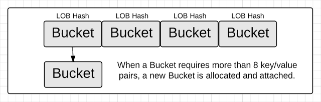
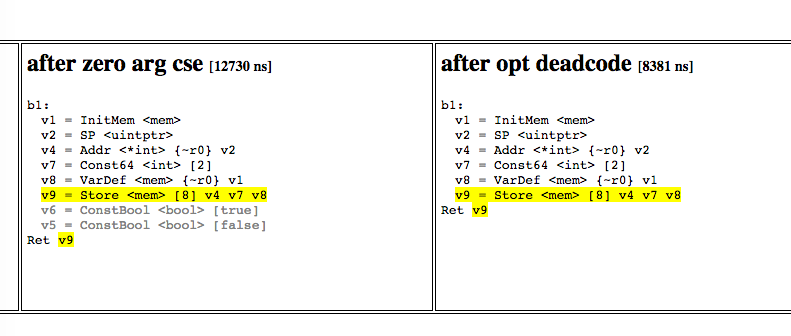

name: inverse
layout: true
class: center, middle, inverse
---

# Взгляд на Go изнутри 2

Адрес презентации - http://bit.ly/go-runtime-2

.footnote.to-bottom[Слава Бахмутов http://twitter.com/m0sth8]

???
Внутренности Go

Похожий доклад я уже рассказывал на конференции в Новосибирске, к сожалению от него нет хорошей записи.

Отличие этого доклада в том, я ещё покажу, где что находится в коде и как с ним работать.

---

layout: false

# Содержание

1. Типы данных
1. Особенности net/http
1. Выбор syscall в random
1. Вызов приватных методов
1. SSA
1. Эскейп анализ

---
name: sub-article
layout: true
class: center, middle, sub-article
---

# Типы данных. 

---

layout: false

# Основной источник информации

1. https://golang.org/ref/spec - спецификация
2. https://github.com/golang/go - исходный код

???
Всю информацию по языку можно почерпнуть в его спецификации, которая не такая уж и большая.
Но в некоторых случаях: особенности имплементации или конкретные стандартные библиотеки, без исходного кода не обойтись.

---

# Базовые числовые типы

```
uint8       the set of all unsigned  8-bit integers (0 to 255)
uint16      the set of all unsigned 16-bit integers (0 to 65535)
uint32      the set of all unsigned 32-bit integers (0 to 4294967295)
uint64      the set of all unsigned 64-bit integers (0 to 18446744073709551615)

int8        the set of all signed  8-bit integers (-128 to 127)
int16       the set of all signed 16-bit integers (-32768 to 32767)
int32       the set of all signed 32-bit integers (-2147483648 to 2147483647)
int64       the set of all signed 64-bit integers (-9223372036854775808 
													to 9223372036854775807)

float32     the set of all IEEE-754 32-bit floating-point numbers
float64     the set of all IEEE-754 64-bit floating-point numbers

complex64   the set of all complex numbers with float32 real and imaginary parts
complex128  the set of all complex numbers with float64 real and imaginary parts

byte        alias for uint8
rune        alias for int32

uint     either 32 or 64 bits
int      same size as uint
uintptr  an unsigned integer large enough to store the uninterpreted 
		 bits of a pointer value
```

.footnote.to-right[[спецификация](https://golang.org/ref/spec#Types)]

???
Go предоставляет набор числовых целых и с плавающей точкой типов. 


---

layout: true

# Слайсы

---


```cpp
type slice struct {
	array unsafe.Pointer
	len   int
	cap   int
}
```
https://github.com/golang/go/blob/master/src/runtime/slice.go#L11

???
Помимо обычных массивов. Которые представляют собой просто кусок памяти, выделяемый под нужное количество элементов. В Го есть такая штука, как слайсы (срезы). Внутри он обычная ссылочная структура, где есть ссылка на выделенный массив, длина среза и его вместительность (то на сколько слайс может расширяться в нижележащий массив)

---

 .resize[]

## s := make([]byte, 5)

???
Чтобы создании нового слайса можно сказать, сколько элементов в массиве нужно создать, так же можно третьим параметром указать вместительность внутренного массива.

---

 .resize[]

## s[2:4]
???
Слайс ссылается на кусок массива, но в таком случае, при изменении элементов слайса будет изменяться и исходный слайс. Более того, несмотря на то что мы указали, что хотим взять только два элемента из исходного слайса, при добавлении новых элементов, наш слайс заиспользует весь нижележащий массив. 
Чтобы этого не происходило, при взятии диапазона, можно так же указывать капасити третьим параметром.
Часто подобные проблемы возникают у начинающих разработчиков, которые заполняя буфер при чтении сокетов, отправляют кусок этого буфера дальше на обработку, но не учитывают, что он через некоторое время перезапишется новыми данными из сокета.
Всё это даёт возможность для ручной оптимизаций работы с буферами.

---
layout: false

# Строки

Всего лишь неизменяемые слайсы из байт + обвязка

```cpp
type stringStruct struct {
	str unsafe.Pointer
	len int
}
```

https://github.com/golang/go/blob/master/src/runtime/string.go#L217

---

# Строки

Итерация (range) по строке возвращает rune:

```(golang)

// stringiter2 returns the rune that starts at s[k]
// and the index where the next rune starts.
func stringiter2(s string, k int) (int, rune) {
	if k >= len(s) {
		// 0 is end of iteration
		return 0, 0
	}

	c := s[k]
	if c < runeself {
		return k + 1, rune(c)
	}

	// multi-char rune
	r, n := charntorune(s[k:])
	return k + n, r
}
```

---

# Строки

Итератор по байтам в строке `range []byte(stroka)`
```(golang)
func stringtoslicebytetmp(s string) []byte {
	// Return a slice referring to the actual string bytes.
	// This is only for use by internal compiler optimizations
	// that know that the slice won't be mutated.
	// The only such case today is:
	// for i, c := range []byte(str)

	str := stringStructOf(&s)
	ret := slice{array: str.str, len: str.len, cap: str.len}
	return *(*[]byte)(unsafe.Pointer(&ret))
}
```

---

# Мапы

.resize[]

https://github.com/golang/go/blob/master/src/runtime/hashmap.go#L105

???
Обычная хеш таблица, с разными оптимизациями. Всё делится на бакеты, в каждом из которых хранится 8 элементов. Обращение к бакетам идёт через low order byte. Внутри бакета через high order byte


---

# Мапы

.resize[]

Когда размера бакета не хватает, выделяется новый и добавляется ссылка в старом бакете. В определённый момент, хеш таблица решит перестраиваться.

---

# Мапы

.resize[]

Выделяется память в два раза больше чем раньше. И постепенно все бакеты туда эвакуируются. При обращении к ним.

---

# Оптимизации 

```cpp
s := "foo"
for i, c := range []byte(s) {
    // аллокации списка не будет
}
```

```cpp
var m map[string]...
m[string(b)] // тоже никакой новой аллокации
```

```cpp
b := []byte{...}

"<"+string(b)+">"

if string(b) == "foo"
// и в этих двух случаях так же
```

https://github.com/golang/go/wiki/CompilerOptimizations

???
Если компилятор знает, что срез байтов не будет изменяться, то при конвертации в строку, может использоваться один и тот же нижележащий срез. Это же действительно и наоборот.

---

# Оптимизации 

Разбросаны по коду (cmd/compile/internal/gc/order.go)
```(go)
	case ORANGE:
		// n.Right is the expression being ranged over.
		// order it, and then make a copy if we need one.
		...

		// Mark []byte(str) range expression to reuse string backing storage.
		// It is safe because the storage cannot be mutated.
		if n.Right.Op == OSTRARRAYBYTE {
			n.Right.Op = OSTRARRAYBYTETMP
		}

```

[источник](https://github.com/golang/go/blob/bbe5da42600d5ab26cd58ffac3d6427994f08fb2/src/cmd/compile/internal/gc/order.go#L714)

---


layout: false
template: sub-article

# Особенности net/http

https://golang.org/pkg/net/http - документация

---

# Особенности net/http

### [Документация Client.Do](https://golang.org/pkg/net/http/#Client.Do)

```

An error is returned if caused by client policy (such as CheckRedirect),
 or if there was an HTTP protocol error. A non-2xx response doesn't cause an error.

When err is nil, resp always contains a non-nil resp.Body.

```

???
В документации по методу Do, который вызывается при запросе в http клиенте, сказано, 
что ошибка возвращается в случае ошибок http протокола или в случае ошибок политик клиента,
 например проверки на редирект.

Но знаете ли вы, в каких случаях возвращается одновременно ошибка и response?

---

# Особенности net/http

#### метод `func (c *Client) doFollowingRedirects`:
```
   511		if redirectFailed {
   512			// Special case for Go 1 compatibility: return both the response
   513			// and an error if the CheckRedirect function failed.
   514			// See https://golang.org/issue/3795
   515			return resp, urlErr
   516		}
```

https://golang.org/src/net/http/client.go?s=6511:6572#L511


???
Существует специальный случай для обратной совместимости, которой нигде в документации не описан.
И иногда это может вызывать проблемы (например при проверках в тестах, что response должен быть nil при ошибке)

---

# Особенности net/http

#### [Документация Client.Do](https://golang.org/pkg/net/http/#Client.Do)

```

Callers should close resp.Body when done reading from it. 
If resp.Body is not closed, the Client's underlying RoundTripper (typically Transport)
may not be able to re-use a persistent TCP connection to the server
for a subsequent "keep-alive" request.

```
<br />
<br />
[Баг в docker/runc:](https://github.com/docker/docker/issues/14203#issuecomment-174177790)

> 1. The new container reads its configuration as JSON
> 1. The JSON decoder does not read the final \n from the pipe, because as far as it's concerned it has completed unmarshaling. 

???
Все уже знают, что при работе с http клиентом, в полученном ответе нужно всегда закрывать Body,
 иначе у нас повиснет горутина, которая долна будет вычитать этот Body. 
 Но мало кто знает, что нужно не просто закрывать body, но и вычитывать из него оставшиеся данные.
Например подобная проблема была в docker https://github.com/docker/docker/issues/14203#issuecomment-174177790.
Когда ответ был в json, но в конце был символ новой строки, который не читался декодером. Поэтому body не вычитывался до конца.
Соединение обрывалось и не переиспользовалось.
---


# Особенности net/http


Пример возможной обработки есть в [коде].

```
// Read the body if small so underlying TCP connection will be re-used.
// No need to check for errors: if it fails, Transport won't reuse it anyway.

const maxBodySlurpSize = 2 << 10

if resp.ContentLength == -1 || resp.ContentLength <= maxBodySlurpSize {

	io.CopyN(ioutil.Discard, resp.Body, maxBodySlurpSize)

}
```
???
Вычитываем остаток body, ограничивая по размеру (чтобы не вычитывать вечно)


---

layout: false
template: sub-article

# Работа таймеров

---

# Работа таймеров

[код](https://github.com/golang/go/blob/0104a31b8fbcbe52728a08867b26415d282c35d2/src/runtime/time.go#L154)

```
// Timerproc runs the time-driven events.
// It sleeps until the next event in the timers heap.
// If addtimer inserts a new earlier event, addtimer1 wakes timerproc early.
func timerproc() {
...

// Heap maintenance algorithms.

func siftupTimer(i int) {
	t := timers.t
	when := t[i].when
	tmp := t[i]
	for i > 0 {
		p := (i - 1) / 4 // parent
		if when >= t[p].when {
			break
		}
		t[i] = t[p]
		t[i].i = i
		t[p] = tmp
		t[p].i = p
		i = p
	}
}

```

---

layout: false
template: sub-article

# Работа с syscall в crypto/rand

---

# Работа с syscall в crypto/rand

[код](https://github.com/golang/go/blob/master/src/crypto/rand/rand_linux.go)

```(golang)
func pickStrategy() {
	// Test whether we should use the system call or /dev/urandom.
	// We'll fall back to urandom if:
	// - the kernel is too old (before 3.17)
	// - the machine has no entropy available (early boot + no hardware
	//   entropy source?) and we want to avoid blocking later.
	var buf [1]byte
	n, err := unix.GetRandom(buf[:], unix.GRND_NONBLOCK)
	useSyscall = n == 1 && err == nil
}

func getRandomLinux(p []byte) (ok bool) {
	once.Do(pickStrategy)
	if !useSyscall {
		return false
	}
	n, err := unix.GetRandom(p, 0)
	return n == len(p) && err == nil
}
```

---

# Работа с syscall в crypto/rand

```(golang)
// GetRandom calls the Linux getrandom system call.
// See https://git.kernel.org/cgit/linux/kernel/git/torvalds/linux.git/commit/?id=c6e9d6f38894798696f23c8084ca7edbf16ee895
func GetRandom(p []byte, flags GetRandomFlag) (n int, err error) {
	if randomTrap == 0 {
		return 0, syscall.ENOSYS
	}
	if len(p) == 0 {
		return 0, nil
	}
	if atomic.LoadInt32(&randomUnsupported) != 0 {
		return 0, syscall.ENOSYS
	}
	r1, _, errno := syscall.Syscall(randomTrap,
		uintptr(unsafe.Pointer(&p[0])),
		uintptr(len(p)),
		uintptr(flags))
	if errno != 0 {
		if errno == syscall.ENOSYS {
			atomic.StoreInt32(&randomUnsupported, 1)
		}
		return 0, errno
	}
	return int(r1), nil
}
```
[код](https://github.com/golang/go/blob/0104a31b8fbcbe52728a08867b26415d282c35d2/src/internal/syscall/unix/getrandom_linux.go#L26)

---

layout: false
template: sub-article


# Вызов приватных методов

???
Иногда хочется вызвать какую-то функцию из стандартной библиотеки, не копируя его кода. 
Это плохая практика, так как приватное апи и скорее всего совместимость может быть нарушена в будущих версиях.
Но, оптимизации требуют жертв.
---

# Вызов приватных методов

`//go:linkname`

```(golang)
package net

import (
    ...
    _ "unsafe" // For go:linkname
)

...

// byteIndex is strings.IndexByte. It returns the index of the
// first instance of c in s, or -1 if c is not present in s.
// strings.IndexByte is implemented in  runtime/asm_$GOARCH.s
//go:linkname byteIndex strings.IndexByte
func byteIndex(s string, c byte) int


```

https://github.com/golang/go/blob/master/src/net/parse.go#L87

---

# Вызов приватных методов

```(golang)
package main

import (
	"fmt"
	_ "unsafe"
)

// byteIndex is strings.IndexByte. It returns the index of the
// first instance of c in s, or -1 if c is not present in s.
// strings.IndexByte is implemented in  runtime/asm_$GOARCH.s
//go:linkname byteIndex strings.IndexByte
func byteIndex(s string, c byte) int

func main() {
	fmt.Printf("found in %v\n", byteIndex("abcdefg", 'e'))
}
```

Или [пакет](https://github.com/sitano/gsysint) для ручного скедулинга горутин через приватные методы.

???
Пример вызова приватного метода. 
Чтобы избежать проблемы с добавлением -complete флага, 
можно добавить пустой файл с импортом C или добавить пустой ассемблер файл.

---

layout: false
template: sub-article

# SSA 

[static single assignment form](https://en.wikipedia.org/wiki/Static_single_assignment_form)

---

# SSA - это что такое?

```
# Обычное представление
y = 1
y = 2
x = y

# SSA
y1 = 1
y2 = 2
x1 = y2

```

---

# SSA - это что такое?

SSA делает возможными или существенно упрощает следующие оптимизационные алгоритмы:

- свёртка констант
- удаление мёртвого кода
- нумерация глобальных значений
- частичное устранение избыточности
- снижение стоимости операций
- распределение регистров

---

# SSA

https://github.com/golang/go/tree/master/src/cmd/compile/internal/ssa код

Посмотреть оптимизации:

`GOSSAFUNC=<func_name> go build ./main.go`

[пример](https://m0sth8.github.io/runtime-2/test/1/ssa.html)

.resize[]

---

layout: false
template: sub-article

# Эскейп анализ

---

# Эскейп анализ

1. Go сам решает, где выделяется память
2. Определяет, выходят ли указатели на значение за функцию или нет
3. Если нет, то данные спокойно располагаются на стеке (с исключениями)
4. Данные на стеке удаляются после выхода из функции и освобождения стека все скопом.
5. Нет повода беспокоить сборщик мусора

???
Эскейп анализ позволяет определить, покидает ли та или иная переменная за область действия той области видимости, где она объявлена. Это даёт компилятору возможность понять где выделить память под объект, на стеке или в куче. Это помогает избежать лишних выделений памяти и разгрузить сборщик мусора.

---

.resize[]

---
.resize[]

---
.resize[]

---

# Блеск и нищита эскейп анализа

```cpp
m := make(map[int]*T) // the map does not escape
m[0] = new(T) // BAD: new(T) escapes

```

```cpp
var y int  // BAD: y escapes
func(p *int, x int) {
    *p = x
}(&y, 42)
```

```cpp
func noescape(y ...interface{}) {
}

func main() {
    x := 0 // BAD: x escapes
    noescape(&x)
}
```

.footnote.to-right[[Go Escape Analysis Flaws](https://docs.google.com/document/d/1CxgUBPlx9iJzkz9JWkb6tIpTe5q32QDmz8l0BouG0Cw/preview)]

---

# Эскейп анализ

[Исправление variadic аргументов](https://github.com/golang/go/commit/f7a39a54e9c75207bdf2f54fbb5e41d947e058f1#diff-e167892a7efae29376180b3014884b1cR627)

---


layout: false

# Источники
1. [Спецификация](https://golang.org/ref/spec)
1. [Исходный код](https://github.com/golang/go/)
1. [Slice internals](http://blog.golang.org/go-slices-usage-and-internals)
1. [Go Maps](http://www.goinggo.net/2013/12/macro-view-of-map-internals-in-go.html)
1. [Go Escape Analysis Flaws](https://docs.google.com/document/d/1CxgUBPlx9iJzkz9JWkb6tIpTe5q32QDmz8l0BouG0Cw/preview)
1. [Five things that make Go fast](http://dave.cheney.net/2014/06/07/five-things-that-make-go-fast)
1. [Вызов приватных методов](https://sitano.github.io/2016/04/28/golang-private/)
1. [Вызов приватных методов2](http://www.alangpierce.com/blog/2016/03/17/adventures-in-go-accessing-unexported-functions/)

---

# Контакты

- Twitter : http://twitter.com/m0sth8
- Email: m0sth8@gmail.com
- Slack: http://4gophers.ru/slack
- Golangshow: http://golangshow.com
- Google group: https://groups.google.com/forum/#!forum/golang-ru
- Презентация: http://bit.ly/go-runtime-2
